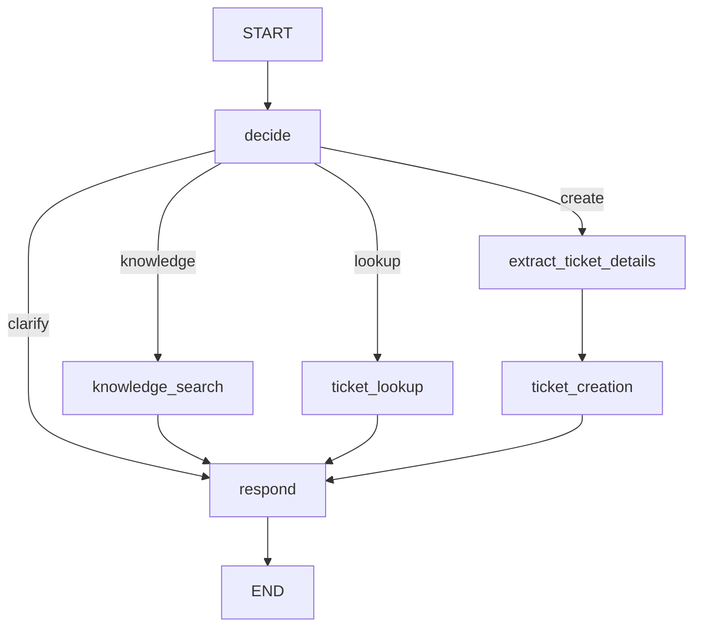

# AssistIQ LangGraph Workflow

## Purpose

AssistIQ uses LangGraph to coordinate local IT support requests. The graph classifies each user message, routes it to the appropriate operation, executes deterministic tools, and produces a grounded response.

The graph supports four intents:

- `knowledge`: search the local IT knowledge base
- `lookup`: find existing tickets for a verified employee
- `create`: validate and create a support ticket
- `clarify`: ask the user to choose an action or provide more information

## Graph Flow

The graph is compiled in `src/graph/graph.py` by `build_graph()`. The exported `support_graph` is invoked by the FastAPI service.

## Nodes

### `decide`

`decide_intent()` reads the latest user message and prepares the common state updates:

- Stores the normalized `user_query`
- Clears the previous error, tool result, and knowledge sources for the new turn
- Extracts labeled software-request fields when present
- Normalizes employee IDs such as `emp-1024` to `EMP1024`
- Selects the `knowledge`, `lookup`, `create`, or `clarify` route

Keyword rules handle common actions first. When those rules cannot determine the intent, the optional LLM classifier is used. If the LLM is unavailable or returns an unsupported value, the graph remains on `clarify`.

An explicit request for a `new`, `another`, or `separate` ticket clears the previous ticket-draft fields. This prevents a prior ticket from being reused accidentally in the same conversation.

### `extract_ticket_details`

`extract_details_from_query()` uses the optional structured LLM extractor to identify natural-language ticket details such as the application, business reason, device, and problem. Extracted values are written into the graph state before ticket creation.

Vague follow-ups are not sent to the extractor. This allows a request such as `still not working, create a ticket` to use the explicit ticket context already present in the conversation.

### `knowledge_search`

`run_knowledge_search()` calls the local knowledge-search tool. The retriever uses OpenAI embeddings with a lazily built, persisted FAISS index over `data/knowledge_base.json`. The result contains matching articles, source IDs, and vector distance scores. The response node uses only those retrieved results when constructing a knowledge response.

### `ticket_lookup`

`run_ticket_lookup()` requires a valid employee ID and calls the SQLite-backed ticket lookup tool. Invalid or missing employee IDs produce a controlled error response.

### `ticket_creation`

`run_ticket_creation()` validates the employee ID and ticket content before writing to SQLite:

1. Verify the employee exists.
2. Validate complete software-request fields when a software request is detected.
3. Require a meaningful problem description for a general ticket.
4. Derive a title and description when they were not explicitly labeled.
5. Search for a similar open ticket.
6. Block the write when a similar open ticket is found.
7. Call the ticket-create tool for a new ticket.

A detail-free request such as `I want to create a new ticket` returns a request for more information. It does not reuse the previous ticket because the `decide` node has already cleared the stale draft fields.

### `respond`

`generate_response()` first returns workflow errors. Otherwise it asks the optional response-generation LLM to produce wording grounded in the verified tool result. If no model is configured or the model fails, deterministic offline responses are used.

Responses may report:

- Retrieved knowledge articles and sources
- Matching tickets
- A newly created ticket ID, status, and priority
- The existing duplicate ticket that prevented creation
- The missing information needed to continue

## State Model

`SupportState` is a `TypedDict` with optional fields so each graph node can return only its updates.

| Field | Purpose |
| --- | --- |
| `messages` | Conversation messages supplied by the API |
| `user_query` | Current user request |
| `employee_id` | Normalized employee identifier |
| `intent` | Selected graph route |
| `ticket_title` | Current ticket title or draft title |
| `ticket_description` | Current ticket description |
| `ticket_problem` | Current issue description used for duplicate detection |
| `application_name` | Software request application |
| `business_reason` | Software request justification |
| `device_name` | Software request device |
| `tool_result` | Result returned by a local tool |
| `response` | Final user-facing response |
| `error` | Controlled validation or tool error |
| `sources` | Knowledge-base source IDs |

## Conversation Persistence

LangGraph itself is compiled without a checkpointer. The FastAPI layer owns conversation persistence:

1. Receive a `thread_id`, or create one for a new conversation.
2. Load the previous state from SQLite.
3. Append the new user message.
4. Invoke `support_graph` with the loaded state and current request.
5. Save the resulting workflow state and messages back to SQLite.
6. Return the response, intent, and source IDs to the client.

This keeps the graph focused on workflow execution while the API and storage layers manage thread identity and persistence.

## Safety Boundaries

- Employee IDs are verified against the local employee data before ticket operations.
- Ticket creation fails closed when the request lacks meaningful details.
- Similar open tickets are blocked rather than duplicated.
- Fresh-ticket requests clear stale draft fields, while vague continuation requests can reuse explicit prior context.
- Tool results, ticket IDs, statuses, and knowledge content are not invented by the response layer.
- The current deployment is local and does not yet provide authentication, authorization, migrations, or long-term memory policies.

## Implementation References

- Graph: `src/graph/graph.py`
- State schema: `src/graph/state.py`
- Graph helpers: `src/graph/graph_utils.py`
- API boundary: `src/api.py`
- Conversation persistence: `src/storage/conversations.py`
- Ticket repository: `src/storage/tickets.py`
- Graph tests: `tests/test_graph.py`
